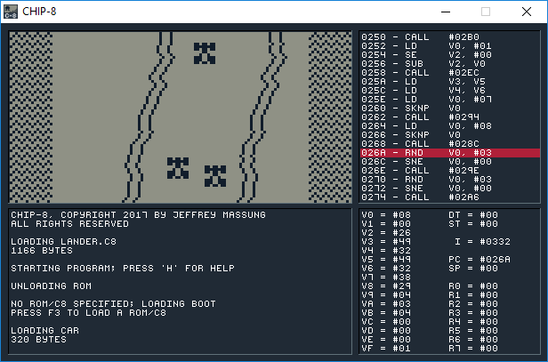

# CHIP-8 Emulator



CHIP-8 is an assembler, debugger, and emulator for the [COSMAC ELF][2] [CHIP-8][3] interpreter and its derivative: the Super CHIP-8, which ran on HP-48 calculators. Everything is emulated as well as possible: the video display refreshes at 60 Hz and sound is emulated as well.

From the screenshot above you can see the disassembled program, register values, and a log which is used to show breakpoint information, memory dumps, and more.

CHIP-8 is written in [Go](https://golang.org/) and uses [SDL](https://www.libsdl.org/) for its rendering, input handling, and audio. It should easily run on Windows, OS X, and Linux.

## Usage

```
CHIP-8 [-b] [ROM|C8]
```

Simply pass the filename of the ROM or a .C8 assembly source file to the executable and CHIP-8 will load it, assemble if required, and begin running it. If no ROM or C8 file is specified then a default ROM ([Pong](https://en.wikipedia.org/wiki/Pong)) is loaded. 

If `-b` is passed as a command line flag, then the CHIP-8 emulator will start with a breakpoint at the first address executed.

Once the program is running, press `F1` at any time to see the list of key commands available to you. But here's a quick breakdown:

* `F1`: show help
* `[`: slow down emulation
* `]`: speed up emulation
* `BACKSPACE`: reset the emulator
* `SPACE`: pause/break emulation
* `F5..F8`: save image slot to disk 
* `Control`+`F5..F8`: load image from slot
* `F9`: toggle user breakpoint (while paused)
* `F10`: single step instruction (while paused)
* `F11`: dump memory at `I` register
* `F12`: save a screenshot to `./screenshot.bmp`

## Emulation Speed

The CHIP-8 was originally written for the [RCA CDP1802 COSMAC ELF](http://www.cosmacelf.com/), and while there is no documentation on the performance of the CHIP-8 virtual machine, after playing around with many of the games, I settled on a default of ~1,000 CHIP-8 instructions per second being emulated.

## Saved ROM Images

All disk images (`F5..F8`) are saved in `~/CHIP-8/IMG_F<5..8>`. They are a perfect snapshot of the CHIP-8 virtual machine.
 
## Assembler

While playing the games that exist for the CHIP-8 might be fun for a while, the real fun is in creating your own games and seeing just how creative you can be with such a limited machine!

Just about every assembler for the CHIP-8 is different, and this one is, too. It's designed with a few niceties in mind. So, bear this in mind and take a few minutes to peruse this documentation.

A heavily documented, example program for the game [Snake](https://en.wikipedia.org/wiki/Snake_(video_game)) can be found in [games/sources/snake.c8](https://github.com/massung/chip-8/blob/master/games/sources/snake.c8).

#### Syntax

Each line of assembly uses the following syntax:

```
.label    instruction  arg0, arg1, ...   ; comment
```

TODO: go over the instruction set, binary, hex, register macros, and tips/tricks.

## That's all folks!

If you have any feedback, please email me. If you find a bug or would like a feature, feel free to open an issue. 

[1]: http://www.cosmacelf.com/
[2]: https://en.wikipedia.org/wiki/RCA_1802
[3]: https://en.wikipedia.org/wiki/CHIP-8/
